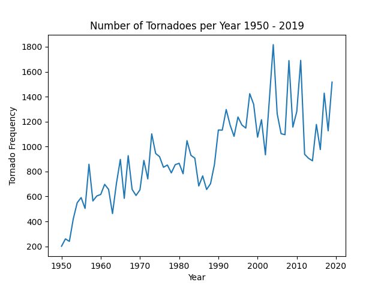

# Storms
This project features examining extreme storm events and performing geospatial analyses. The below figure shows the frequency of tornadoes in the US by Year and map shows total number of tornadoes by state from 1950 to 2019.

This python project is still in progress. Further analyses will be accomplished.

The tornado.py file contains the analysis and resulting figures and maps.

# Figures

# Maps

